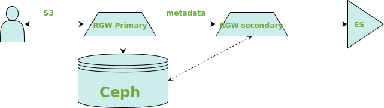

## ELK - www.elastic.co


---

## Logging

+ *rsyslog*, *syslog-ng* to forward logs to Logstash
+ Filebeat
+ Ceph has Graylog (GELF) support
+ store logs for later use
+ analyze logs for [Alerting](https://www.elastic.co/products/x-pack/alerting)
+ analyze data with Machine Learning
  + [X-Pack machine learning](https://www.elastic.co/products/x-pack/machine-learning)
  + [R client](https://ropensci.org/tutorials/elastic_tutorial/)
+ trouble shooting/postmortem analyze

--

### Forwarding Logs

+ you can format your logs before forwarding
+ there is a tutorial for *rsyslog* how to reformat to GELF
+ Logstash has a lot of pipeline input modules
  + `syslog { }`
  + `graylog { }`
+ Filebeat

--

### Ceph GELF

+ to forward logs in GELF, update ceph.conf
  + `log_to_graylog = true`
  + `log_graylog_host = 127.0.0.1`
  + `log_graylog_port = 12201`
+ restart ceph services
+ or use [DeepSea](https://github.com/suse/deepsea)
  + has support for [custom Ceph config options](https://github.com/SUSE/DeepSea/tree/master/srv/salt/ceph/configuration/files/ceph.conf.d)
    + `salt-run state.orch ceph.stage.3`
    + that also would restart services correctly

--

### Parse and manage

+ Logstash provides methods to parse logs
+ simple alerting could be done with Logstash
+ use `grok { }` and other Filters of Logstash
  + to add fields
  + better indexing and managing your data
+ [Ceph Logstash example](https://github.com/irq0/ceph-tools/blob/master/logstash/logstash.conf)
+ [Supportconfig Analyzer](https://github.com/denisok/elk_supportconfig)

--

### Logstash pipeline filter example

```rb
filter {
  if [type] == "cephlog" {
    grok { 
      # https://github.com/ceph/ceph/blob/master/src/log/Entry.h
      match => { "message" => "(?m)%{TIMESTAMP_ISO8601:stamp}\s%{NOTSPACE:thread}\s*%{INT:prio}\s(%{WORD:subsys}|):?\s%{GREEDYDATA:msg}" }

      # https://github.com/ceph/ceph/blob/master/src/common/LogEntry.h
      match => { "message" => "%{TIMESTAMP_ISO8601:stamp}\s%{NOTSPACE:name}\s%{NOTSPACE:who_type}\s%{NOTSPACE:who_addr}\s%{INT:seq}\s:\s%{PROG:channel}\s\[%{WORD:prio}\]\s%{GREEDYDATA:msg}" }
    }
    date { match => [ "stamp", "yyyy-MM-dd HH:mm:ss.SSSSSS", "ISO8601" ] }
  }
}
```

---

## ELK cluster

[`docker-compose` ](https://github.com/denisok/elk_supportconfig/blob/master/docker-compose.yml)is simple to use for development needs

```yaml
elasticsearch:
  image: docker.elastic.co/elasticsearch/elasticsearch-oss:${TAG}
  container_name: elasticsearch
  environment:
    - 'ELASTIC_PASSWORD=${ELASTIC_PASSWORD}'
    ports: ['9200:9200']
    networks: ['esnet']

logstash:
  image: docker.elastic.co/logstash/logstash-oss:${TAG}
  container_name: logstash
  volumes:
    - ./pipeline/:/usr/share/logstash/pipeline/
    - ./kibana/:/tmp/kibana/
    - ./logs/:/tmp/supportconfig/
  environment:
    - 'config.reload.automatic=true'
    ports: ['9600:9600']
    networks: ['esnet']
```

--

### Kibana dashboard


--

### Kibana search


---

## RGW
+ Object storage client to the ceph cluster, exposes a RESTFUL S3 & Swift API


---

### RGW
+ A RESTful API access to object storage, a la S3 
+ implements user accounts, acls, buckets
+ heavy ecosystem of s3/swift client tooling can be leveraged against RGW

--

### RGW
+ Supports a lot of S3 like features
  - Multipart uploads
  - Object Versioning
  - torrents
  - lifecycle
  - encryption
  - compression
  - static websites
  - metadata search...
+ From Jewel we support multisite which allows geographical redundancy

---

## ElasticSearch
> _You know, for search_

- distributed
- horizontally scalable
- schemaless
- speaks REST
- Easy Configuration without setting your hair on fire


--

##  RGW Metadata search with ES
### Motivation
+ Objects have metadata associated with them that is often interesting to analyze
+ Since it is an "object storage" you don't have any traditional filesystems tool at your disposal
+ No `du`, `df` & friends, and either way these are hard on a dist. storage system

--

### Motivation
+ Some existing support with admin API, however the problems with this:
  - returns specific metadata, not ideal for aggregation
  - no notifications when new objects/buckets/accounts are created
  - also permissions for users to access the admin API is tricky, since admin API was meant for administering
+ As an storage administrator you'd be interested in finding out for eg. the top 10 users, average object size etc., no of objects held on a user account etc.

--

### Design
+ Built atop of the multisite architecture, where data & metadata is forwarded to multiple zones
+ From Kraken, we have sync plugins
+ Allows for data & metadata to be forwarded to _external_ tiers, allows for building of:
  * Interesting solutions analyzing bucket/object/user metadata (ES for starts)
  * Backup solutions (S3/cloud sync plugin for Mimic)

--

## Elastic Sync Plugin

+ Forwards metadata from other zones onto a ES instance
+ Requires a read only zone that doesn't cater to user requests & only forwards to ES
+ No off the shelf authentication module that can work with RGW
+ Recommendation to not expose ES endpoint to public

--

## Elastic Sync Plugin: User Requests
+ For normal user requests, RGW itself can authenticate the user; ensures users don't see other's data
+ We have an attribute mentioning owners for an object and this is used to service user requests
+ Also allows for custom metadata fields to be set up per user

--

</img>

--

Eg. metadata

```json
{
	    _index" : "rgw-default-6cb1f916",
        "_type" : "object",
        "_id" : "86740559-297e-4487-b770-d3106b900a97.34125.1:american-gods:null",
        "_score" : 0.2876821,
        "_source" : {
          "bucket" : "s3bucket",
          "name" : "american-gods",
          "instance" : "null",
          "versioned_epoch" : 0,
          "owner" : {
            "id" : "jane.doe",
            "display_name" : "Jane Doe"
          },
          "permissions" : [
            "jane.doe"
          ],
          "meta" : {
            "size" : 1387924,
            "mtime" : "2018-02-01T22:27:36.490Z",
            "etag" : "d41d8cd98f00b204e9800998ecf8427e",
            "tail_tag" : "86740559-297e-4487-b770-d3106b900a97.34125.7336",
            "x-amz-content-sha256" : "e3b0c44298fc1c149afbf4c8996fb92427ae41e4649b934ca495991b7852b855",
            "x-amz-date" : "20180201T222736Z"
          },
          "tagging" : [
            {
              "key" : "author",
              "value" : "gaiman"
            }]}}
```

--

### Query
```json
curl -XPOST 'localhost:9200/rgw-gold/_search?size=0&pretty' -d
{
    "aggs" : {
        "avg_size" : { "avg" : { "field" : "meta.size" } }
    }
}```

--

### Response

```json
{
  "took" : 22,
  "timed_out" : false,
  "_shards" : {
    "total" : 10,
    "successful" : 10,
    "failed" : 0
  },
  "hits" : {
    "total" : 22,
    "max_score" : 0.0,
    "hits" : [ ]
  },
  "aggregations" : {
    "avg_size" : {
      "value" : 177.72727272727272
    }
  }
} ```

--

## Interesting queries possible
- Object storage PUT requests on a specific time range.
- Stats on objects with specific metadata content 
  + It is possible to index metadata to non string fields on a per bucket basis

---

## Future work
- Support for ES 6 for RGW
- Custom metadata fields for object tagging
- Elastic queries to analyze common system faults
- Integration into Ceph dashboard
- Analyze of meta and/or log data with Machine Learning

--

## Contribute

- https://github.com/denisok/elk_supportconfig Github Repo for ongoing ELK work
- https://ceph.com/IRC/ - Ceph upstream community mailing lists and IRC channels
- http://lists.suse.com/mailman/listinfo/deepsea-users - DeepSea upstream mailing list. 
- https://groups.google.com/forum/#!forum/openattic-users - openATTIC upstream mailing list. 
- https://github.com/ceph/ceph - upstream Ceph sources 


